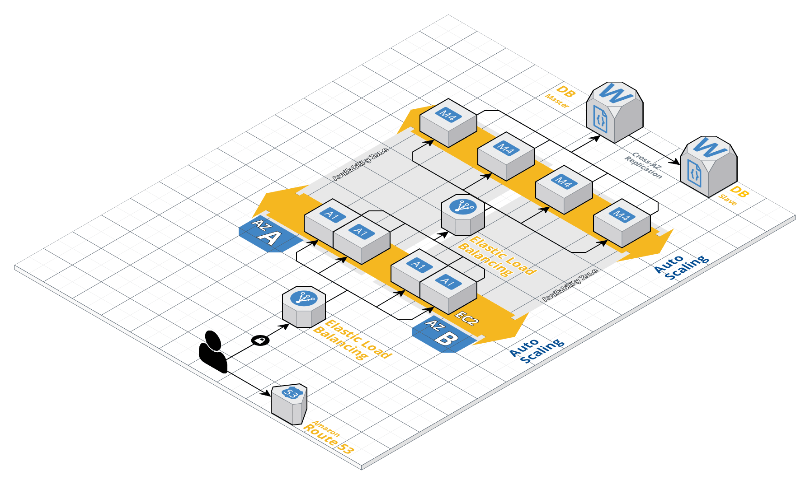

# MonoAppDeploy
Monolithic Web App Deployment Strategies with Cloud Infrastructure design and CI/CD Pipeline

This will contain the webapp itself written in Golang, the AWS cloud infrastructure diagram, the whole CI/CD pipeline and tools and cfg files.

This is a simple article manager with normal Authentication and Authorisation and display of articles for all and individual
The webapp folder contains a Dockerfile and docker-compose.yml file for development purposes.

#### CI/CD Pipeline
The DevOps approach to this small project/webapp will start from the dev all the way to the production.

	Phases for the CI/CD pipeline are
	- Development and Testing
	- Packaging the builds with QA approved tests
	- Deploying the ready builds to the prod servers 

#### Setting up the Environments
I used packer for creating the Provisioned AMI for Production Instances
To setup the Production Environments I have used Terraform for creating the infrastructure
This is my AWS architecture Setup 

I used Ansible to setup the Build servers and install jenkins 

##### Development and testing 

##### Packaging the builds with QA

##### Deploying to prod